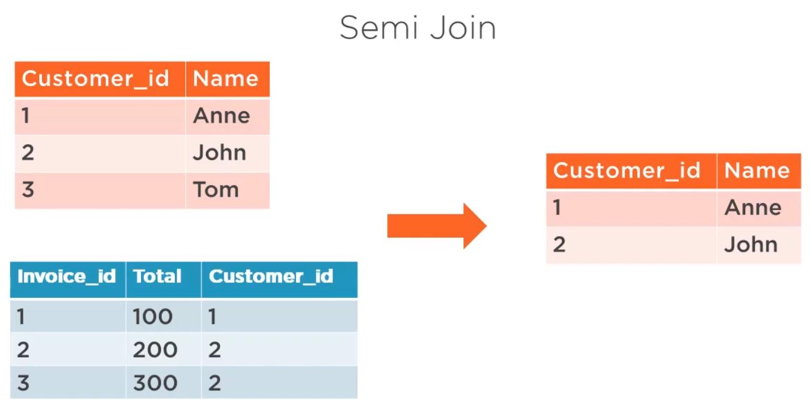
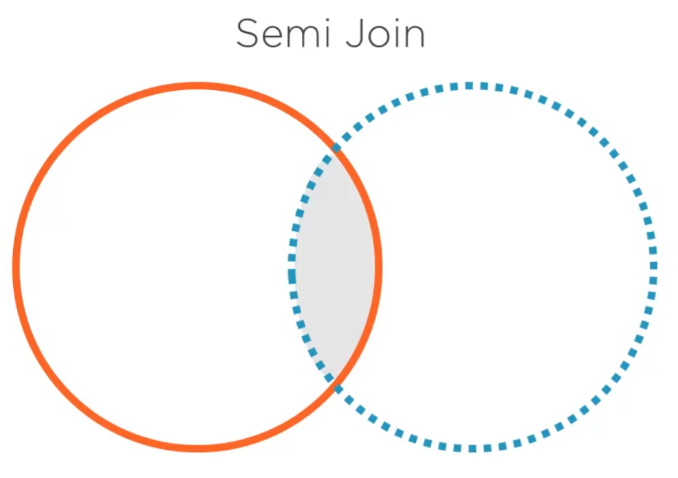
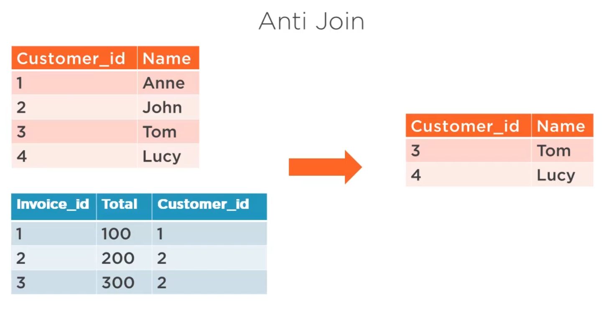
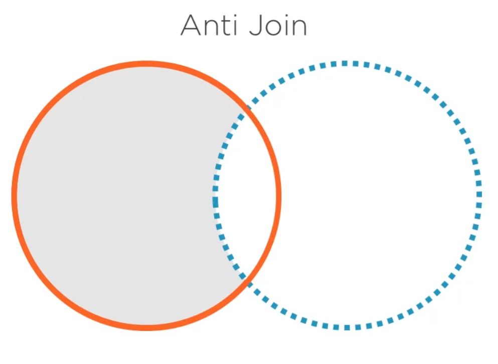

```{r setup, include=FALSE}
knitr::opts_chunk$set(echo = TRUE)
library(dplyr)
```

## Joining Data Sets with dplyr Course Subsection

### Why dplyr?

* dplyr is created with data frame manipulation as focus
* dplyr has good performance optimization
* dplyr is apart of tidyverse and integrates well with the other packages

```{r}
# To see all the objects included in dplyr
# ls('package:dplyr')

# To filter prior list:
listing <- ls('package:dplyr')
grep('join', listing) # Returns indices of pertinent packages

# To see actual values of those indices
listing[grep('join', listing)]
```

### Inner Joins

Ex 1 (one to one)
```{r}
(customer.names <- data.frame(id=1:3,
                              name=c('Helena', 'Astrid', 'Eduardo')))

(customer.countries <- data.frame(customer_id=2:4,
                                  country=c('USA', 'Spain', 'USA')))

# Note that customer.names and customer.countries have a one to one relationship on the id atrribute

# Previously with merge we would create an inner join with:
merge(customer.names, customer.countries, 
      by.x = 'id', by.y = 'customer_id')

# Now with dplyr:
inner_join(customer.names, customer.countries, by = c('id' = 'customer_id'))

```

Ex 2 (one to many)
```{r}
(customers <- data.frame(customer_id=1:3,
                         name=c('Anna', 'Bill', 'Cliff')))

(invoices <- data.frame(invoice_id=1:5,
                        total=  c(100, 200, 300, 400, 500),
                        cust_id=c(2,   3,   1,   NA,  3)))

# Note that customer.names and customer.countries have a one to one relationship on the id atrribute

# Previously with merge we would create an inner join with:
merge(invoices, customers, by.x = 'cust_id', by.y = 'customer_id')

# Now with dplyr
inner_join(invoices, customers, by=c('cust_id'='customer_id'))

```
Note that the output order between the merge and dplyr solutions differ

* With dplyr, the order is not affected (retains the same order as the first data frame)

Ex 3 (many to many)
```{r}

(names <- data.frame(first.name=c('Helena','Helena','Tom'),
                     last.name= c('Jones', 'Troy',  'Jones'),
                     age=       c(20,      30,      40)))

(countries <- data.frame(fn=     c('Helena','Helena','Tom'),
                         ln=     c('Jones', 'Troy',  'Jones'),
                         country=c('USA',   'UK',    'USA')))

# Note the keys here are composite

# Previously with merge we would create an inner join with:
merge(names, countries, by.x = c('first.name', 'last.name'),
                        by.y = c('fn',         'ln'))

# Now with dplyr
inner_join(names, countries, by = c('first.name'='fn', 
                                    'last.name'='ln'))
```

### Left, Right, and Full Outer Joins

```{r}
customer.names <- data.frame(id=1:3, 
                             name=c('Helena','Astrid','Eduardo'))

customer.countries <- data.frame(customer_id=2:4, 
                                 country=c('USA','Spain','USA'))

# Note this is again a one to one relationship

# Previously with merge we would create a left join with:
merge(customer.names, customer.countries, 
      by.x = 'id', by.y = 'customer_id', all.x = TRUE)

# Now with dplyr
left_join(customer.names, customer.countries, 
          by = c('id'='customer_id'))

# Previously with merge we would create a right join with:
merge(customer.names, customer.countries, 
      by.x = 'id', by.y = 'customer_id', all.y = TRUE)

# Now with dplyr
right_join(customer.names, customer.countries, 
           by = c('id'='customer_id'))

# Previously with merge we would create a full outer join with:
merge(customer.names, customer.countries, 
      by.x = 'id', by.y = 'customer_id', all = TRUE)

# Now with dplyr
full_join(customer.names, customer.countries, 
          by = c('id'='customer_id'))

```


Another, bit more complex example (many to many):

* Note that with many to many relations, we must:
    + Step 1: Join with the linked data frame
    + Step 2: Join output with the other data frame
```{r}
(invoices <- data.frame(invoice_id=1:3,
                        total=c(1000, 2000, 3000)))

(services <- data.frame(service_id=1:3,
                        name=c('consulting', 'training', 'coaching')))

(invoicelines <- data.frame(service_id=c(1, 2, 1, 2),
                            invoice_id=c(1, 1, 2, 2),
                            price=c(500, 500, 1000, 1000)))

# Previously with merge we would create a full outer join with:
(merged_invoices_lines <- merge(invoices, invoicelines, 
                                by = 'invoice_id', all = TRUE))

(merged_services_invoices <- merge(merged_invoices_lines, services, 
                                   by = 'service_id', all = TRUE))
 
# Now with dplyr
(full_invoices_lines <- full_join(invoices, invoicelines))
# Note the warning thrown by the natural join - [Joining, by = "invoice_id"]

# For a more robust solution, explicitly state the shared attribute to join on
(full_services_invoices <- full_join(full_invoices_lines, services, 
                                     by = "service_id")) 

```

Now for some additional joins dplyr can accomplish:

### Semi Joins

* Allow a more specific subset of rows to be returned: only the common values in a data frame
    + For ex: only customers with invoices
    

* Note: This is similar to an inner joins but...
    + Inner joins return all data from the shared attribute column of both of the data frames
    + While semi joins only return data from the shared attribute column of one of the data frames
    


```{r}
(customers <- data.frame(customer_id=1:3,
                         name=c('Anne', 'John', 'Tom')))

(invoices <- data.frame(invoice_id=1:4,
                        total=c(100, 200, 300, 50),
                        customer_id=c(1, 2, 2, 3)))

# First note the result of the inner join
inner_join(customers, invoices, by = 'customer_id')

# And now the result of the semi join
semi_join(customers, invoices, by = 'customer_id')
```

### Anti Joins

* The opposite of a semi join... returns only the non-common values in a data frame





```{r}
(customers <- data.frame(customer_id=1:4,
                         name=c('Anne', 'John', 'Tom', 'Lucy')))

(invoices <- data.frame(invoice_id=1:3,
                        total=c(100, 200, 300),
                        customer_id=c(1, 2, 2)))

# First note the output of a semi join
semi_join(customers, invoices, by = 'customer_id')

# And now the output of an anti join
anti_join(customers, invoices, by = 'customer_id')

# Note that if we combine the results of the semi and anti joins, we get the full customer data frame
customers
```


